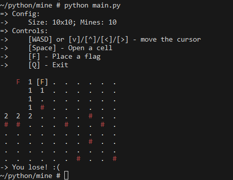

# mine.py
small console-ui minesweeper clone in python.

## overview


## quickstart
```console
$ pip install colorama \ # for ansi on windows
>             readchar   # for reading chars
...
$ python main.py
# Ta-da!
```

